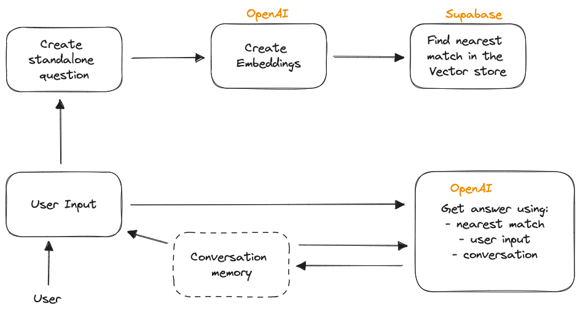

# FAQify



FAQbot is a chatbot designed to provide answers to frequently asked questions. It is built using natural language processing to understand user queries and respond with the most relevant answers from a knowledge base of FAQs.

## Prerequisites

To try this project on your local machine, ensure you have following prerequisites.

1. [Bun](https://bun.sh/)
2. An account with [Supabase](https://supabase.com/)
3.

### Run the project

Create a `.env`

```
SUPABASE_API_KEY="***"
SUPABASE_URL_LC_CHATBOT="https://***.supabase.co"
OPENAI_API_KEY="sk-***"
```

**Setup Vector Database**

1. The FAQs you need, add them to `/knowledge/info.txt`. Run `temp.js` that will create `output.txt` in the same directory.
2. Create a table in the data store to store vectors. Run a query from the Supbase SQL editor:

```sql
-- Enable the pgvector extension to work with embedding vectors
create extension vector;

-- Create a table to store your documents
create table documents (
  id bigserial primary key,
  content text, -- corresponds to Document.pageContent
  metadata jsonb, -- corresponds to Document.metadata
  embedding vector(1536) -- 1536 works for OpenAI embeddings, change if needed
);

-- Create a function to search for documents
create function match_documents (
  query_embedding vector(1536),
  match_count int DEFAULT null,
  filter jsonb DEFAULT '{}'
) returns table (
  id bigint,
  content text,
  metadata jsonb,
  similarity float
)
language plpgsql
as $$
#variable_conflict use_column
begin
  return query
  select
    id,
    content,
    metadata,
    1 - (documents.embedding <=> query_embedding) as similarity
  from documents
  where metadata @> filter
  order by documents.embedding <=> query_embedding
  limit match_count;
end;
$$;
```

3. Run `temp.js` to save them as vectors to supabaseVDB.
4. Run the project

```sh
bun run index.js
```

> **Hint:** I paused working on this project for now. I'll soon get back to make it better.

## License

This project is licensed under the terms of the MIT license.

The MIT License is a short and simple permissive license with conditions only requiring preservation of copyright and license notices. Licensed works, modifications, and larger works may be distributed under different terms and without source code.
